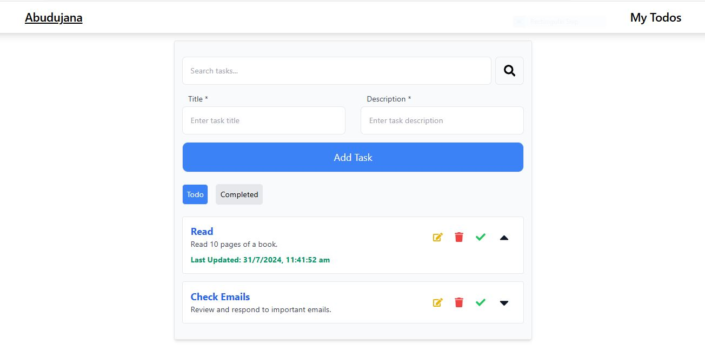
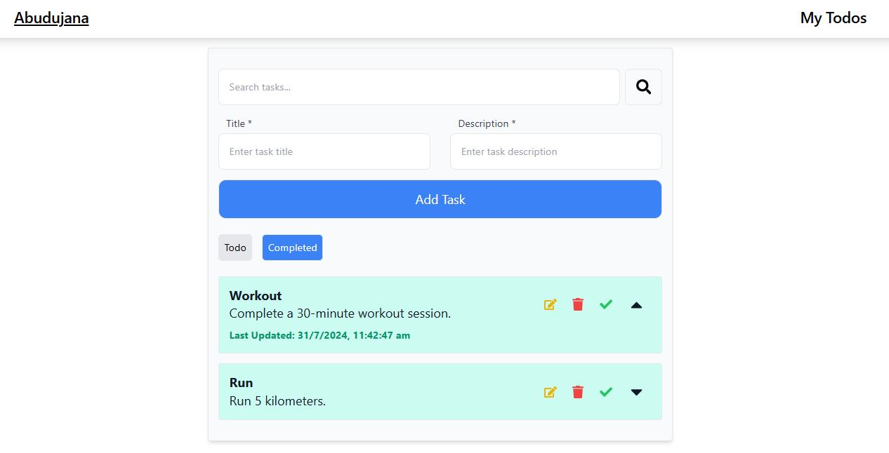

# Task Manager Application

## Overview

The Task Manager Application is a modern web application built with React, Node.js, MongoDB, and styled using Tailwind CSS. It enables users to manage tasks efficiently, offering features such as task creation, updating, marking as completed, and searching. The application also includes an expandable list view to display task details and timestamps.

### Features

- **Create Task:** Add new tasks with titles and descriptions.
- **Update Task:** Edit existing tasks' titles and descriptions.
- **Mark as Done:** Toggle tasks between completed and pending states.
- **Search Tasks:** Filter tasks based on keywords in titles or descriptions.
- **Expandable List:** View task details and last update timestamp in an expandable format.
- **Responsive Design:** Utilizes Tailwind CSS for a modern, responsive design.
- **Data Storage:** Uses MongoDB for data persistence and Express for backend API.

## Screenshots

###  Todo Task List



###  Completed Task list




### Technologies Used

**Frontend:**
- **React:** Frontend framework for building interactive UIs.
- **Tailwind CSS:** Utility-first CSS framework for rapid design.
- **CSS:** For additional styling and layout.

**Backend:**
- **Node.js:** JavaScript runtime for server-side logic.
- **Express:** Web framework for building RESTful APIs.
- **MongoDB:** NoSQL database for storing tasks data.

## Getting Started

### Prerequisites

- [Node.js](https://nodejs.org/) (v14 or higher)
- [npm](https://www.npmjs.com/) or [yarn](https://yarnpkg.com/) (package managers)
- [MongoDB](https://www.mongodb.com/) (Database)

### Installation

1. **Clone the Repository**

   ```bash
   git clone https://github.com/yourusername/todoApp.git
   cd todoApp
2. **Install Frontend Dependencies**
    Navigate to the frontend directory and install dependencies:
    cd frontend
        npm install
        # or
        yarn install

3. **Install Backend Dependencies**
    Navigate to the backend directory and install dependencies:
    cd ../backend
        npm install
        # or
        yarn install

4. **Set Up Tailwind CSS**
       **Ensure Tailwind CSS is properly set up in your frontend project:**
            Install Tailwind CSS:
            npm install -D tailwindcss postcss autoprefixer
            npx tailwindcss init
       **Configure Tailwind in tailwind.config.js:**
                    module.exports = {
                    content: [
                        "./src/**/*.{js,jsx,ts,tsx}",
                    ],
                    theme: {
                        extend: {},
                    },
                    plugins: [],
                    }
        **Add Tailwind Directives to your CSS file:**            

        **In src/styles.css:**
                @tailwind base;
                @tailwind components;
                @tailwind utilities;


**5** **Set Up the Database**
        Ensure MongoDB is running on your local machine or configure a cloud database. Update the MongoDB connection string in backend/config/db.js
**6**  **Run the Backend Server**
            Start the backend server:
                npm start
                # or
                yarn start
                The backend server will run on http://localhost:3001.

 **7**       **Run the Frontend Application**   
                    Navigate back to the frontend directory and start the React application:
                        cd ../frontend
                        npm start
                        # or
                        yarn start
                The frontend application will run on http://localhost:3000.        
     
**Contributing**
        Contributions are welcome! If you have suggestions or improvements, please:

**Fork the repository.**
    Create a new branch (git checkout -b feature/your-feature).
    Make your changes and commit them (git commit -am 'Add new feature').
    Push to the branch (git push origin feature/your-feature).
    Create a new Pull Request.

    
